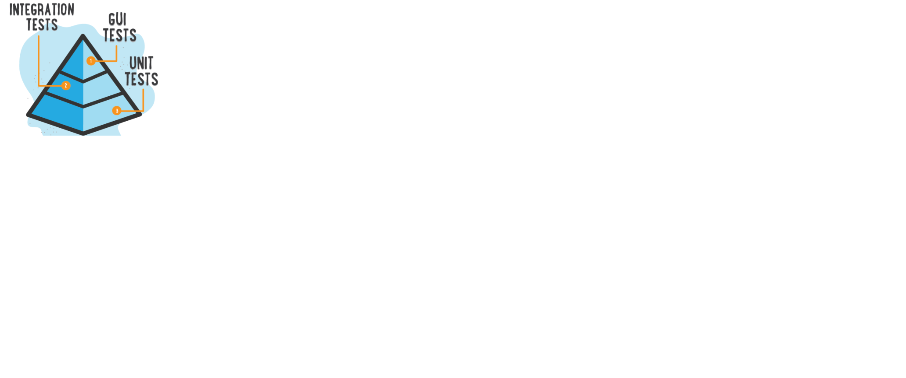

## Testing at all levels:
To achieve continuous delivery, quality should be intact at every level.

### Unit Testing
1. Method level testing done by developers on their local dev machines.
2. UI unit coverage can be evaluated from tools like Karma.
3. API unit coverage can be evaluated from tools like Sonar.
4. Developers test data is limited and the data is mocked.
5. Jenkins build fails if any unit tests fail.

### Functional testing 
1. Feature testing done by QA’s or developers on QA env or local machines. (Ideal situation is QA's testing feature branch in QA env).
2. Making sure the functionality of the feature is intact as per the requirement discussed during early phase.
3. Manual testing of the feature if the automated tests were not written in the same sprint.
4. Automated tests feature/regression run as part of CI to make sure other functionalities are working as expected.
5. If the automated tests build failed, an alert is sent to the developers and QA’s to look for the test case or cases that failed with      the new feature development.

### Performance testing 
1. Feature performance testing done by QA’s or developers on local or QA env.
2. Display results through charts to stakeholders and business.
3. This does not replicate the real prod scenario, so it may be approx. results that can raise an alarm before the feature is
   released.
4. Performance testing can be performed based on the user research results. 

### Integration testing 
1. All the features are merged to the release branch and is deployed to staging environment (pre production environment).
2. This is the time where a QA member steps up and performs regression testing and feature level testing.
3. The data is somewhat real as it is refreshed to the lower environments from prod before start of the sprint.
4. Any critical bug that can be fixed before the release is added to the release branch and regression testing executes again.
5. If critical bug cannot be fixed at given time, the release is cancelled and later a hotfix release is scheduled.
