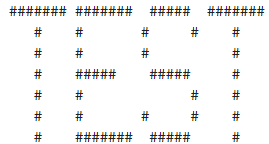

### Text Conversion
1. Manually test the feature branch to make sure all the combinations pass. (Banner text style, fonts and width)
    * Example: (Happy path)
        * actual_input = Plain text (TEST)
        * Font = Banner
        * Width = 100
        * expected_output = banner.txt and preview 
        
2. If all the test cases pass, add the high quality test cases to automation suite that runs in continuous integration development            practice.
